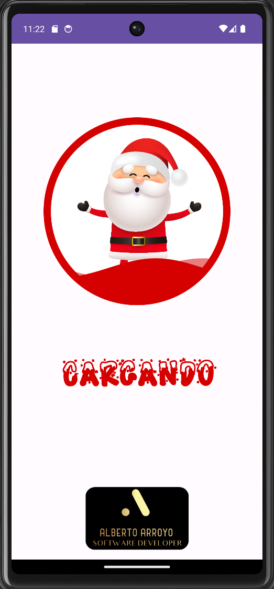
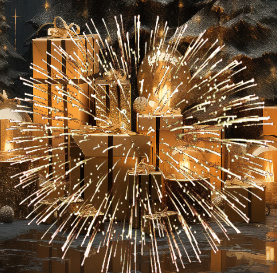
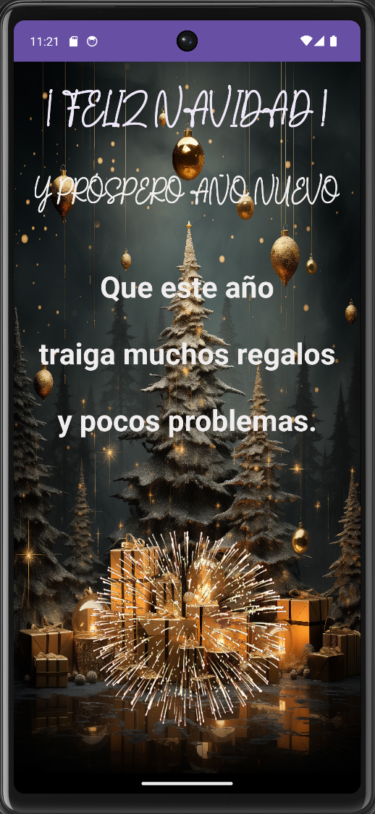

# Programación Multimedia y Dispositivos móviles. 

## AR-1. Felicitación navideña. 

Realizada por:

**ALBERTO ARROYO SANTOFIMIA**

*Crea tu propia felicitación navideña que contenga un SPLASH con alguna animación que dé paso a la felicitación.*

SPLASH de un Papá Noel con una animación en la que aparece la palabra
cargando y desaparece

Música navidena de fondo.

Van saliendo las siguiente frases con distintos efectos

Una vez que han terminado las frases se carga la siguiente imagen gif
con efecto de fuegos artificiales

El resultado final

